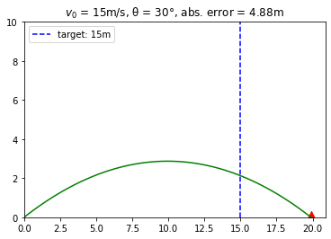

# projectile-env
## Description
Solve a custom `gym` projectile environment with q-learning implemented from scratch.

## The Environment
A device shoots a projectile from the ground toward a target that is also at ground level. The device is initialized with a default initial velocity (we'll set this to 15m/s but you can change it if you want). Assuming acceleration due to gravity (g) is 9.8m/s², given a discrete target distance, determine the nearest <ins>available</ins> angle (in degrees) the projectile should be jetted at. 


  
Note: We also supply the target range. The standard q-learning algorithm is commonly applied to discrete state and action spaces so it is more intuitive to provide whole number target values (and thus whole number states)

Also, in this environment, there are nine angles available: 5°, 10°, 15°, 20°, 25°, 30°, 35°, 40° and 45°

### The State space
This is a simple environment. The states will simply be discrete values representing the target distances implemented using the `Box` data structure provided in the `gym.spaces` sublibrary.

The state space is defined in the `__init__` method:
```
self.observation_space = Box(low=target_low, high=target_high, shape=(1,), dtype=np.int32)
```

### The Action space
Similarly, the action space is discrete, representing the angles to choose from. The action space is represented by the `Discrete` data structure.

I set up the action space using these lines in the `__init__` method:
```
self.action_space = Discrete(9)

self.action_to_angle = {
    0:5,
    1:10,
    2:15,
    3:20,
    4:25, 
    5:30, 
    6:35, 
    7:40,
    8:45
}
```
The attribute `action_to_angle` will serve as a lookup for converting supplied action values to angles.

## The reward scheme
If the angle supplied during a timestep results in reducing the minimum error achieved for that target distance, the reward for that timestep is `+1`. If the error is greater, the reward is `-1`. If there is no change in the minimum error for that target value, the reward is simple, `0`.😐

This way, the policy indirectly trained will be to either reduce the error, or supply the angle that achieved the lowest error.  
  